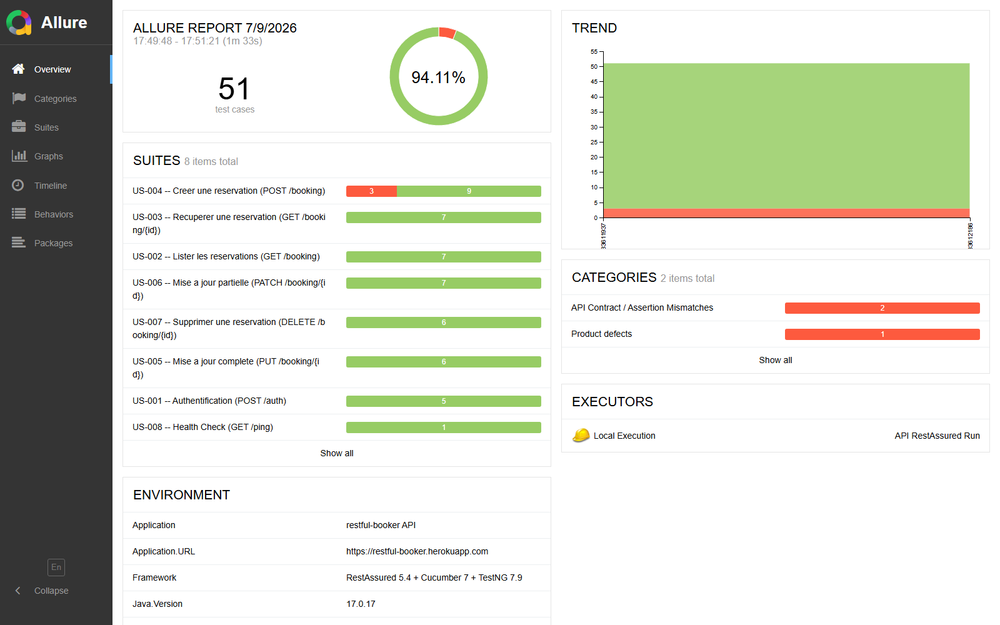

# API Tests — Java · RestAssured · Cucumber · TestNG

> Portage Java du framework [`api-pytest-framework`](../api-pytest-framework/) (Python/pytest-bdd) : **mêmes scénarios Gherkin, même API testée, même écosystème d'agents IA** — pour démontrer une couverture fonctionnelle identique livrée dans deux stacks différentes.

---

## Stack

- **RestAssured 5.4** — client HTTP fluent pour tests API
- **Cucumber 7.14** + **TestNG 7.9** — BDD, exécution, retry
- **Java 17** + Maven
- **Allure 2.24** — reporting
- **Agents IA** : Python (Groq / Ollama fallback), 10 agents

## Application testée

**restful-booker.herokuapp.com** — API REST publique de réservation hôtelière (Auth, CRUD Booking, Health Check).

## Scope — 8 features / 51 scénarios

| Feature | Endpoint | Scénarios |
|---|---|---|
| `auth.feature` | `POST /auth` | 5 |
| `booking_list.feature` | `GET /booking` | 7 |
| `booking_get.feature` | `GET /booking/{id}` | 7 |
| `booking_create.feature` | `POST /booking` | 12 |
| `booking_update.feature` | `PUT /booking/{id}` | 6 |
| `booking_patch.feature` | `PATCH /booking/{id}` | 7 |
| `booking_delete.feature` | `DELETE /booking/{id}` | 6 |
| `health_check.feature` | `GET /ping` | 1 |

Le texte Gherkin est identique à celui d'`api-pytest-framework` (mêmes tags `@smoke`/`@critical`/`@tc-xxx`, mêmes références Jira `# HBAPI-xx`) — portage fidèle, pas de réinterprétation des scénarios.

## Exécution locale

```bash
mvn clean test -Denv=local
```

Filtrer par tag :
```bash
mvn clean test -Denv=local -Dcucumber.filter.tags="@smoke"
```

Configuration par environnement : `src/test/resources/properties/{local,staging,production}.properties`, surchargeable via `-Dkey=value` ou variables d'environnement.

**Résultat sur `restful-booker.herokuapp.com` (run réel)** : 54/57 exécutions passent (94,7 %). Les 3 échecs (`TC-028` prix négatif, `TC-029` checkin > checkout, `TC-031` XSS) sont dus à l'API publique elle-même, plus permissive que l'assertion attendue — pas un défaut du portage Java (mêmes requêtes HTTP que la version Python).

## Rapport Allure

KPIs (Environment), Categories d'échecs et Trend multi-run — générés automatiquement via `AllureSuiteListener` :



```bash
python agents/reporting-agent.py generate   # target/allure-report/
python agents/reporting-agent.py serve      # ouvre dans le navigateur
```

## Retry automatique

`RetryAnalyzer` / `RetryTransformer` — relance automatique des scénarios en échec (jusqu'à 2x) au niveau TestNG, enregistrés via `META-INF/services/org.testng.ITestNGListener`.

## Agents IA — `agents/`

| Agent | Rôle |
|---|---|
| `pipeline-agent.py` | Orchestrateur maître (full / quick / nightly / smoke / gate) |
| `runner-agent.py` | Exécution Maven + détection flaky |
| `bug-agent.py` | Triage, RCA (Chain of Thought), patch correctif Java |
| `quality-agent.py` | KPI, quality gate, vérification cohérence |
| `advisor-agent.py` | Vote GO/NO-GO (Self-Consistency), prédiction |
| `reporting-agent.py` | Allure report, dashboard HTML, Slack/Teams |
| `planning-agent.py` | Catalogue des features, couverture, Jira |
| `ci-agent.py` | Git commit (sans `.env`), push, PR, release |
| `observability-agent.py` | Traces LLM, circuit breaker, coûts, prompts |
| `codegen-agent.py` | Génération feature + steps + client Java |

Modules partagés (copiés depuis `api-pytest-framework/agents/`) : `llm.py`, `prompt_store.py`, `circuit_breaker.py`, `tracer.py`, `memory_store.py`, `jira_fetcher_agent.py`.

```bash
pip install -r agents/requirements.txt
python agents/pipeline-agent.py status
python agents/pipeline-agent.py smoke
python agents/bug-agent.py triage
python agents/advisor-agent.py release
```

Variables requises : voir `.env.example` (clé Groq, config Jira, webhooks Slack/Teams).

## CI/CD

`.github/workflows/ci-api-restassured.yml` :
- Push/PR sur `api-Java-Rest-Assured/**` → suite complète
- `workflow_dispatch` avec choix de suite (all / smoke / critical)
- Nightly (06h30 UTC, lun-ven)
- Pipeline IA (triage, RCA, sync Jira, vote GO/NO-GO) après chaque run
- Publication Allure sur GitHub Pages

## Architecture

```
src/main/java/com/restfulbooker/
├── config/ConfigLoader.java     # lecture properties par env
├── client/BaseApiClient.java    # RequestSpecification (baseURI, Content-Type, cookie token)
├── client/AuthClient.java       # POST /auth
├── client/BookingClient.java    # CRUD /booking
├── client/HealthClient.java     # GET /ping
└── payloads/BookingPayloads.java

src/test/java/com/restfulbooker/
├── context/ScenarioContext.java # état partagé entre step classes (DI cucumber-picocontainer)
├── steps/                       # CommonSteps + 1 classe par feature
├── listener/                    # RetryAnalyzer, RetryTransformer
└── runners/RunnerTest.java
```

---

Le reste de l'architecture (quality gates, secteurs couverts, positionnement) est décrit dans le [README racine](../README.md).
