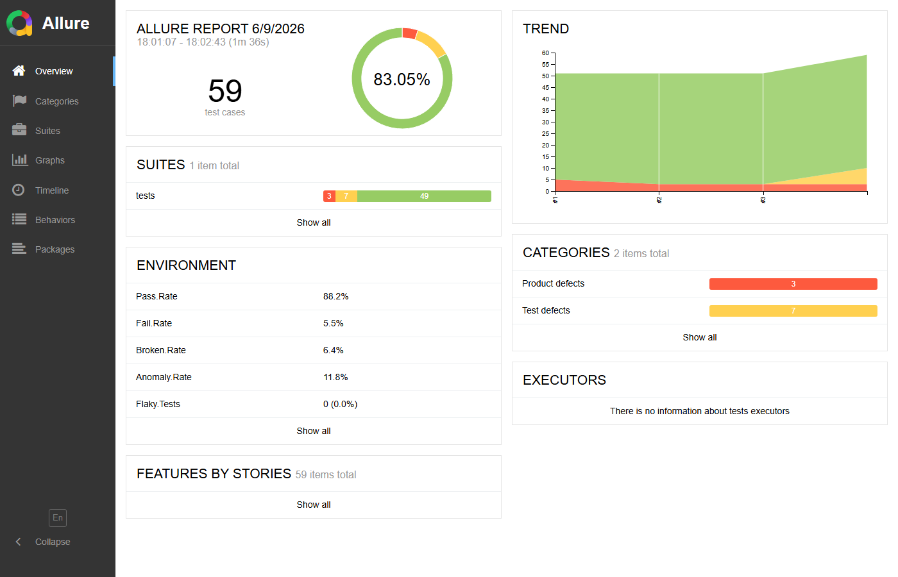

# QA Platform — API pytest-bdd + AI Agents

[](https://github.com/Faicel-Testing/qa-plateforme/actions/workflows/ci-api-pytest.yml)
[](https://github.com/Faicel-Testing/qa-plateforme/actions/workflows/ci-api-pytest.yml)
[](https://faicel-testing.github.io/qa-plateforme/api-pytest-framework/)
[](https://faicel-testing.github.io/qa-plateforme/api-pytest-framework/)
[](https://www.python.org/)
[](https://github.com/pytest-dev/pytest-bdd)
[](https://console.groq.com/)

> **pytest-bdd + Requests + Groq AI** — Un framework de test API qui se pilote, se synchronise et se documente lui-même.
> **17 agents IA** · GO/NO-GO production · Détection flaky · Dashboard KPI client-ready

---

## Vue d'ensemble

```
Spec métier  →  Features Gherkin  →  Tests API  →  Allure Report  →  Jira TCs
     ↑                                                    ↓
     └─────────────── 14 agents IA pilotent tout ─────────┘
```

51 cas de test BDD couvrant l'API REST [restful-booker](https://restful-booker.herokuapp.com), avec synchronisation automatique des statuts dans Jira, pipeline CI/CD GitHub Actions, rapports Allure générés à chaque exécution et **dashboard KPI professionnel** (Pass Rate, Flaky Rate, GO/NO-GO production).

---

## Rapport Allure — Live

> **[Voir le rapport en direct](https://faicel-testing.github.io/qa-plateforme/api-pytest-framework/)** — mis à jour automatiquement à chaque push sur `main`.



*Rapport Allure : KPIs intégrés (Pass Rate 88.2% · Flaky 0% · Anomalies 11.8%) — Trend 4 runs — ENVIRONMENT widget généré automatiquement par `kpi-agent.py`*

---

## Architecture

```
┌─────────────────────────────────────────────────────────────────────────────┐
│                        api-pytest-framework                                  │
│                      QA Automation AI Platform                               │
└─────────────────────────────────────────────────────────────────────────────┘

┌─────────────────────────────────────────────────────────────────────────────┐
│  TRIGGER LAYER                                                               │
│                                                                              │
│   git push ──────────┐   gh workflow run ───┐   cron lun-ven 06h00 UTC ──┐  │
│                      └──────────────────────┴────────────────────────────▼  │
│                                                    .github/workflows/        │
│                                                    ci-api-pytest.yml         │
└─────────────────────────────────────────────────────┬───────────────────────┘
                                                      │
                                                      ▼
┌─────────────────────────────────────────────────────────────────────────────┐
│  TEST LAYER  (pytest-bdd + Gherkin)                                          │
│                                                                              │
│  features/                          tests/                                   │
│  ├── auth.feature                   ├── test_auth_bdd.py                    │
│  ├── health_check.feature           ├── test_health_check_bdd.py            │
│  ├── booking_list.feature           ├── test_booking_list_bdd.py            │
│  ├── booking_get.feature            ├── test_booking_get_bdd.py             │
│  ├── booking_create.feature         ├── test_booking_create_bdd.py          │
│  ├── booking_update.feature         ├── test_booking_update_bdd.py          │
│  ├── booking_patch.feature          ├── test_booking_patch_bdd.py           │
│  └── booking_delete.feature         └── test_booking_delete_bdd.py          │
│                                                                              │
│                       51 TCs  |  48 PASS  |  3 FAIL                         │
└──────────────┬──────────────────────────────────────────────────────────────┘
               │
     ┌─────────┼─────────────┐
     ▼         ▼             ▼
┌──────────┐ ┌────────────┐ ┌──────────────────┐
│  pages/  │ │ payloads/  │ │    schemas/       │
│          │ │            │ │                   │
│ base_    │ │ booking_   │ │ booking_schema.py │
│  api.py  │ │ payloads   │ │ JSON Schema       │
│ auth_    │ │ .py        │ │ validation        │
│  page.py │ │            │ │                   │
│ booking_ │ │ POST/PUT/  │ └──────────────────┘
│  page.py │ │ PATCH body │
│ health_  │ └────────────┘     config.py / conftest.py
│  page.py │                    .env  (BASE_URL, GROQ_API_KEY,
└──────────┘                          JIRA_URL, JIRA_TOKEN)
               │
               ▼
┌─────────────────────────────────────────────────────────────────────────────┐
│  REPORTING LAYER                                                             │
│                                                                              │
│  pytest run → allure-results/ → allure generate → allure-report/ (HTML)     │
│                (JSON par TC)     (Allure CLI)       allure serve :5050       │
│                                                                              │
│  GitHub Artifacts : allure-results + allure-report (rétention 30 jours)     │
└─────────────────────────────────────────────────────────────────────────────┘

┌─────────────────────────────────────────────────────────────────────────────┐
│  AI AGENT LAYER  (Groq LLaMA 3.3 70B + Python)                              │
│                                                                              │
│  ┌──────────────────┐  ┌───────────────────────┐  ┌──────────────────────┐ │
│  │  AGENTS TEST     │  │    AGENTS JIRA        │  │  AGENTS GIT/GITHUB   │ │
│  │                  │  │                       │  │                      │ │
│  │ api-spec-agent   │  │ jira-agent            │  │ git-agent            │ │
│  │ api-generate-    │  │ jira-ticket-agent     │  │  commit + push LLM   │ │
│  │   agent          │  │ jira_fetcher_agent    │  │                      │ │
│  │ api-execute-     │  │ status-agent ◄──────────────── Allure → Jira   │ │
│  │   agent          │  │  sync 51 TCs          │  │ github-agent         │ │
│  │ test-case-agent  │  │ sprint-agent           │  │  ci / pr / release   │ │
│  │ qa-agent         │  │  board/backlog/move    │  │  issue / changelog   │ │
│  │ bug-analyzer     │  │ user-stories-agent     │  │                      │ │
│  │ api-reporter-    │  │ create_story           │  └──────────────────────┘ │
│  │   agent          │  └───────────────────────┘                           │
│  └──────────────────┘                                                       │
│                                                                              │
│  llm.py ── Groq API (LLaMA 3.3 70B)   RAG/qa-knowledge.md                  │
└─────────────────────────────────────────────────────────────────────────────┘

┌─────────────────────────────────────────────────────────────────────────────┐
│  INTEGRATION LAYER                                                           │
│                                                                              │
│  ┌─────────────────────────┐        ┌─────────────────────────┐             │
│  │         JIRA            │        │        GITHUB            │             │
│  │  Project : HBAPI        │        │  Repo : QA_Plateforme    │             │
│  │  Board   : id=35        │        │  Release : v1.3.0        │             │
│  │                         │        │  CI : ci-api-pytest.yml  │             │
│  │  Sprint 1 (active)      │        │  Artifacts : 30 jours    │             │
│  │  ├── 10 Stories (US)    │        │  Email notification      │             │
│  │  └── 51 TCs             │        └─────────────────────────┘             │
│  │      ├── 48 Terminé     │                                                 │
│  │      └──  3 En cours    │        ┌─────────────────────────┐             │
│  │                         │        │       GROQ API           │             │
│  │  REST API v3            │        │  LLaMA 3.3 70B           │             │
│  └─────────────────────────┘        │  commit / story / PR     │             │
│                                     └─────────────────────────┘             │
└─────────────────────────────────────────────────────────────────────────────┘

                       FLUX DE DONNÉES COMPLET
                       ────────────────────────

  features/*.feature
         │
         ▼
  pytest-bdd (steps)  ──►  pages/ (requests HTTP)  ──►  API REST restful-booker
         │                        │
         ▼                        ▼
  allure-results/           JSON responses
         │                  + Schema validation (jsonschema)
         │
         ├──► status-agent.py ──► Jira TCs (HBAPI-11..61) statuts mis à jour
         │
         └──► allure-report/  ──► GitHub Artifacts ──► Email notification
```

---

## Les 14 agents IA

### Agents Test

| Agent | Commande | Ce qu'il fait |
|-------|----------|---------------|
| `api-spec-agent.py` | `python agents/api-spec-agent.py` | Lit une spec métier, génère les features Gherkin et les step definitions |
| `api-generate-agent.py` | `python agents/api-generate-agent.py` | Détecte les lacunes de couverture et génère les scénarios manquants |
| `api-execute-agent.py` | `python agents/api-execute-agent.py` | Orchestre l'exécution complète avec analyse des résultats |
| `test-case-agent.py` | `python agents/test-case-agent.py` | Génère des cas de test depuis les endpoints API |
| `qa-agent.py` | `python agents/qa-agent.py` | Analyse la qualité globale de la suite BDD |
| `bug-analyzer.py` | `python agents/bug-analyzer.py` | Lit les résultats Allure, identifie les causes racines |
| `api-reporter-agent.py` | `python agents/api-reporter-agent.py` | Génère un rapport professionnel depuis les résultats |

### Agents Jira

| Agent | Commande | Ce qu'il fait |
|-------|----------|---------------|
| `jira_fetcher_agent.py` | *(module partagé)* | Client Jira REST réutilisable — issues, transitions, sprints |
| `status-agent.py` | `python agents/status-agent.py sync` | Lit les résultats Allure et met à jour les statuts des TCs Jira (Terminé / En cours) |
| `sprint-agent.py` | `python agents/sprint-agent.py board` | Affiche le tableau Kanban, le backlog, déplace les issues |
| `jira-agent.py` | `python agents/jira-agent.py` | Matrice de traçabilité Jira ↔ Features |
| `jira-ticket-agent.py` | `python agents/jira-ticket-agent.py` | Crée des tickets Bug Jira depuis les échecs Allure |
| `user-stories-agent.py` | `python agents/user-stories-agent.py` | Génère des user stories depuis une spec |
| `create_story.py` | `python agents/create_story.py` | Crée directement des stories dans Jira |

### Agents Qualité & Production

| Agent | Commande | Ce qu'il fait |
|-------|----------|---------------|
| `smoke-regression-agent.py` | `python agents/smoke-regression-agent.py gono-go` | Lance les tests @smoke + @critical, émet un verdict GO/NO-GO, crée un bug Jira si bloquant |
| `flaky-agent.py` | `python agents/flaky-agent.py detect --runs=3` | Détecte les tests instables sur N runs, calcule un score de flakiness, mise en quarantaine Jira |
| `kpi-agent.py` | `python agents/kpi-agent.py` | Génère l'ENVIRONMENT widget Allure + un dashboard HTML KPI client-ready |

### Agents Git / GitHub

| Agent | Commande | Ce qu'il fait |
|-------|----------|---------------|
| `git-agent.py` | `python agents/git-agent.py` | Génère un message de commit Conventional Commits via LLM, commit + push |
| `github-agent.py` | `python agents/github-agent.py ci run` | CI/CD, PR, releases, issues, changelog via `gh` CLI |
| `llm.py` | *(module partagé)* | Client Groq (LLaMA 3.3 70B) partagé entre tous les agents |

---

## Pipeline CI/CD GitHub Actions

```
git push api-pytest-framework/**
        │
        ▼
  ci-api-pytest.yml
        │
        ├── [test] Setup Python 3.12
        ├── [test] pip install -r requirements.txt
        ├── [test] pytest tests/ --alluredir=allure-results
        ├── [test] allure generate → allure-report/
        ├── [test] Annotations GitHub (PASS/FAIL summary)
        ├── [test] Upload artifacts (30 jours)
        │
        └── [notify] Email Gmail SMTP → faicel.ganem@gmail.com
```

**Déclencheurs :**
- `push` sur `main` ou `feature/**` (si `api-pytest-framework/**` modifié)
- `pull_request` vers `main`
- `workflow_dispatch` (choix de suite : all / auth / booking_list / booking_get / booking_create / booking_update / booking_patch / booking_delete / health)
- `schedule` : lundi–vendredi 06h00 UTC

```bash
# Déclencher manuellement
python agents/github-agent.py ci run --suite=all
python agents/github-agent.py ci watch
python agents/github-agent.py ci results
```

---

## Stack technique

```
Tests            pytest-bdd 7.3 + Gherkin (Python 3.12)
HTTP Client      requests 2.32
Assertions       assert natif + jsonschema 4.23
Reporting        Allure 2.36 (HTML) + allure-pytest
LLM              Groq Cloud (llama-3.3-70b-versatile) — gratuit
Gestion projet   Jira Cloud REST API v3 + Agile API
CI/CD            GitHub Actions + gh CLI
```

---

## Démarrage rapide

### 1. Prérequis

```bash
python >= 3.12
pip install -r requirements.txt
```

### 2. Configuration

```bash
cp .env.example .env
# Renseigner les variables dans .env :
#   BASE_URL         → https://restful-booker.herokuapp.com
#   GROQ_API_KEY     → clé gratuite sur console.groq.com
#   JIRA_BASE_URL    → https://ton-site.atlassian.net
#   JIRA_EMAIL       → ton email Atlassian
#   JIRA_TOKEN       → token sur id.atlassian.com/manage-profile/security/api-tokens
#   JIRA_PROJECT     → clé du projet (ex: HBAPI)
```

### 3. Lancer les tests

```bash
# Tous les tests BDD
pytest tests/ -v --alluredir=allure-results

# Une suite spécifique
pytest tests/test_auth_bdd.py -v --alluredir=allure-results

# Avec rapport Allure
pytest tests/ --alluredir=allure-results && allure serve allure-results --port 5050
```

### 4. Synchroniser Jira

```bash
# Après exécution des tests — mettre à jour les TCs Jira
python agents/status-agent.py sync

# Visualiser le sprint
python agents/sprint-agent.py board
python agents/sprint-agent.py backlog
```

### 5. Pipeline complet

```bash
# Déclencher CI, attendre, télécharger rapport, sync Jira
python agents/github-agent.py ci full
```

---

## Structure du projet

```
api-pytest-framework/
├── agents/                      # 17 agents IA
│   ├── llm.py                   # Client Groq partagé
│   ├── jira_fetcher_agent.py    # Client Jira partagé
│   ├── status-agent.py          # Allure → Jira statuts
│   ├── sprint-agent.py          # Kanban / backlog / move
│   ├── git-agent.py             # Commit + push LLM
│   ├── github-agent.py          # CI/CD / PR / release
│   ├── api-spec-agent.py        # Spec → Features
│   ├── api-generate-agent.py    # Génération scénarios
│   ├── api-execute-agent.py     # Orchestration exécution
│   ├── api-reporter-agent.py    # Rapport professionnel
│   ├── test-case-agent.py       # Génération TCs
│   ├── qa-agent.py              # Analyse qualité
│   ├── bug-analyzer.py          # Analyse + causes racines
│   ├── jira-agent.py            # Traçabilité
│   ├── jira-ticket-agent.py     # Tickets Bug automatiques
│   ├── user-stories-agent.py    # Génération user stories
│   ├── create_story.py          # Création stories Jira
│   ├── smoke-regression-agent.py # GO/NO-GO production (smoke + critical)
│   ├── flaky-agent.py           # Détection + quarantaine tests instables
│   └── kpi-agent.py             # Dashboard KPI + Allure ENVIRONMENT
├── features/                    # Scénarios Gherkin (8 suites)
│   ├── steps/                   # Step definitions Python
│   └── *.feature
├── pages/                       # Page Object Model API
│   ├── base_api.py              # Classe de base HTTP
│   ├── auth_page.py
│   ├── booking_page.py
│   └── health_page.py
├── tests/                       # Runners pytest-bdd (51 TCs)
│   └── test_*_bdd.py
├── payloads/                    # Corps de requêtes (POST/PUT/PATCH)
│   └── booking_payloads.py
├── schemas/                     # JSON Schema validation
│   └── booking_schema.py
├── RAG/                         # Base de connaissances QA
│   └── qa-knowledge.md
├── .github/workflows/
│   └── ci-api-pytest.yml        # Pipeline GitHub Actions
├── config.py                    # Configuration centralisée
├── conftest.py                  # Fixtures pytest
├── pytest.ini                   # Configuration pytest + Allure
├── requirements.txt
└── .env.example                 # Template de configuration
```

---

## Commandes agents

```bash
# Tests
python agents/api-spec-agent.py              # Spec → Features Gherkin
python agents/api-generate-agent.py          # Scénarios manquants
python agents/api-execute-agent.py           # Exécution orchestrée
python agents/test-case-agent.py             # Génération TCs
python agents/qa-agent.py                    # Analyse qualité
python agents/bug-analyzer.py                # Analyse échecs
python agents/api-reporter-agent.py          # Rapport professionnel

# Qualité & Production
python agents/smoke-regression-agent.py smoke          # 5 TCs @smoke
python agents/smoke-regression-agent.py critical       # 9 TCs @critical
python agents/smoke-regression-agent.py gono-go        # Verdict GO/NO-GO production
python agents/flaky-agent.py detect --runs=3           # Détecter les flaky tests
python agents/flaky-agent.py report                    # Rapport flaky
python agents/flaky-agent.py gono-go                   # Flaky GO/NO-GO critique
python agents/kpi-agent.py                             # Dashboard KPI complet
python agents/kpi-agent.py summary                     # Résumé console
python agents/kpi-agent.py env                         # environment.properties Allure
python agents/kpi-agent.py dashboard                   # docs/kpi-dashboard.html

# Jira
python agents/status-agent.py sync           # Allure → Jira statuts
python agents/status-agent.py report         # Rapport de synchronisation
python agents/sprint-agent.py board          # Tableau Kanban
python agents/sprint-agent.py backlog        # Backlog complet
python agents/sprint-agent.py move HBAPI-11 terminé
python agents/jira-agent.py                  # Traçabilité Jira ↔ Features
python agents/jira-ticket-agent.py           # Tickets Bug automatiques

# Git / GitHub
python agents/git-agent.py                   # Commit + push (message LLM)
python agents/git-agent.py --status          # Résumé repo
python agents/git-agent.py --release=v1.4.0  # Commit + push + release
python agents/github-agent.py ci run         # Déclencher CI
python agents/github-agent.py ci watch       # Suivre l'exécution
python agents/github-agent.py ci results     # Télécharger résultats
python agents/github-agent.py pr create      # Créer une PR
python agents/github-agent.py release create v1.4.0
python agents/github-agent.py changelog      # Générer changelog
```

---

## Couverture de tests

| Suite | TCs | Statut |
|-------|-----|--------|
| Auth (POST /auth) | 5 | ✅ 5 Terminé |
| Health Check (GET /ping) | 3 | ✅ 3 Terminé |
| Booking List (GET /booking) | 5 | ✅ 5 Terminé |
| Booking Get (GET /booking/{id}) | 6 | ✅ 6 Terminé |
| Booking Create (POST /booking) | 8 | ✅ 8 Terminé |
| Booking Update (PUT /booking/{id}) | 8 | ⚠️ 5 Terminé / 3 En cours |
| Booking Patch (PATCH /booking/{id}) | 8 | ✅ 8 Terminé |
| Booking Delete (DELETE /booking/{id}) | 8 | ✅ 8 Terminé |
| **Total** | **51** | **48 ✅ / 3 ⚠️** |

---

## Pourquoi ce framework

| Problème classique | Ce framework |
|--------------------|--------------|
| Exécuter les tests à la main | CI/CD GitHub Actions automatique lun-ven |
| Mettre à jour Jira manuellement | `status-agent` sync Allure → Jira en 1 commande |
| Chercher les TCs dans le backlog | Sprint actif avec board Kanban visible |
| Créer des commits descriptifs | `git-agent` génère le message via LLM |
| Déboguer les échecs à la main | `bug-analyzer` identifie les causes racines |
| Rédiger les features à la main | `api-spec-agent` les génère depuis une spec |
| Valider un déploiement en production | `smoke-regression-agent gono-go` → GO ✅ ou NO-GO ❌ + bug Jira automatique |
| Détecter les tests instables | `flaky-agent detect` → score de flakiness + quarantaine Jira |
| Présenter les KPIs au client | `kpi-agent` → dashboard HTML + widget Allure ENVIRONMENT |

---

*Framework développé avec pytest-bdd, Requests, Groq AI et Jira Cloud API.*
