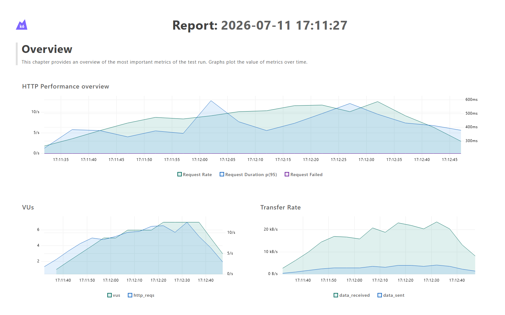

# perf_k6_qacart

**k6 v1.1 · JavaScript · Node.js**
Application sous test : [QACart Todo](https://qacart-todo.herokuapp.com) — 3 scénarios (smoke, load, stress) sur l'API auth réelle
Agents IA : 10 agents JavaScript · 7 patterns LLM · 8 prompts versionnés

> Guide complet des agents → [agents.md](agents.md)
> 7ᵉ framework du dépôt — premier dédié à la **performance** (non-fonctionnel), même écosystème d'agents que `ui_cypress_bdd` / `ui_playwright_bdd`.

---

## Stack technique

| Couche | Technologie | Version |
|---|---|---|
| Langage | JavaScript | — (runtime k6 natif, pas de bundler) |
| Load testing | k6 (Grafana) | 1.1.0 |
| Rapport | Dashboard HTML natif k6 (`--out web-dashboard`) + dashboard KPI Chart.js maison | intégré k6 |
| Agents IA | Node.js + Groq LLM | ≥ 18 |

---

## Pourquoi pas Allure ici

Allure est un rapporteur de **résultats de tests discrets** (pass/fail par scénario Gherkin) — il ne modélise pas des métriques continues (percentiles de latence, débit, taux d'erreur dans le temps). k6 a son propre rapporteur natif depuis la v0.47 (`K6_WEB_DASHBOARD=true`), qui génère un **dashboard HTML autonome** avec graphiques temporels (request rate, p95, VUs, transfert réseau) — l'équivalent pertinent pour du non-fonctionnel. Voir la discussion complète dans le message de conception de ce framework.

---

## Ce que k6 teste réellement sur QACart Todo

Sondage direct de l'API (`curl`) avant d'écrire le moindre scénario :

| Endpoint | Statut | Rôle |
|---|---|---|
| `GET /` | 200 | Shell React (SPA) |
| `POST /api/v1/users/register` | **201** | Création utilisateur, retourne `access_token` |
| `POST /api/v1/users/login` | 200 (creds valides) / **401** (email connu, mdp faux) | Authentification |

**Le CRUD des todos est 100% client-side** : `GET/POST /api/v1/todos` renvoient le shell SPA (route catch-all React), pas une API REST — confirmé par sondage direct. k6 est un outil protocole/HTTP, il ne peut donc pas charger-tester une fonctionnalité qui n'a pas de backend REST. Ce framework se concentre sur la **seule surface API réelle** : le parcours d'authentification (register/login), qui est aussi la question la plus légitime en charge ("le backend d'auth tient-il la charge ?").

---

## Structure du projet

```
perf_k6_qacart/
├── k6/
│   ├── config/env.js          → BASE_URL
│   ├── lib/
│   │   ├── testData.js         → randomUser() (email unique par VU/itération)
│   │   └── api.js              → registerUser, loginUser, loginWrongPassword, getHomepage
│   │                              + http.expectedStatuses(200,201,400,401) (401/400 ne polluent
│   │                                pas http_req_failed — ce sont des statuts métier attendus)
│   └── scenarios/
│       ├── smoke.js             → 1 VU, 5 itérations — sanity check
│       ├── load.js              → 5→8 VUs sur ~80s — charge nominale
│       └── stress.js            → 10→20 VUs sur ~90s — recherche de dégradation (conservateur, voir README § Éthique)
├── scripts/agents/              → 10 agents IA JavaScript
│   ├── llm.js                    Client LLM (Groq/Ollama) + 7 patterns
│   ├── jira-fetcher.js           Client Jira REST v3
│   └── shared/                   tracer · circuit-breaker · memory-store · prompt-store
├── prompts/                      → 8 templates LLM versionnés (semver)
├── docs/                         → screenshot, rapports générés
├── reports/                      → summary-*.json (k6 --summary-export) + dashboard-*.html (natif k6)
├── agents.md                     → Architecture complète des agents
└── .env.example
```

---

## Prérequis

- [k6](https://k6.io/docs/get-started/installation/) (binaire natif, pas un package npm)
- Node.js ≥ 18 (pour les agents IA)
- Clé API Groq (pour les agents IA) — ou Ollama en local

---

## Installation

```bash
npm install

cp .env.example .env
# Remplir GROQ_API_KEY dans .env
```

---

## Exécution des scénarios

```bash
# Scénario individuel (avec dashboard HTML natif)
K6_WEB_DASHBOARD=true K6_WEB_DASHBOARD_EXPORT=reports/dashboard-smoke.html \
  k6 run --summary-export=reports/summary-smoke.json k6/scenarios/smoke.js

# Via npm
npm run test:smoke
npm run test:load
npm run test:stress

# Via l'agent runner (exécute + résumé LLM + mémoire épisodique)
node scripts/agents/runner-agent.js run       # smoke → load → stress
node scripts/agents/runner-agent.js smoke
```

> Le dashboard HTML natif (`K6_WEB_DASHBOARD_EXPORT`) nécessite au moins ~15-20s de données pour produire un export — les scénarios `load`/`stress` (80-90s) le génèrent systématiquement, `smoke` (8s) est trop court.

---

## Rapport



Dashboard natif k6 du scénario `load` (dernier run réel local) — request rate, p95 de latence, VUs (ramp 5→8), débit réseau, dans le temps.

**Résultats réels du dernier run local (3 exécutions consécutives) :**

| Scénario | Requêtes | Checks | p95 | avg | Seuils |
|---|---|---|---|---|---|
| `smoke` | 15 | 15/15 (100%) | 275ms | 191ms | ✅ tous respectés |
| `load` | 653 | 653/653 (100%) | 485ms | 265ms | ✅ tous respectés |
| `stress` | 1218 | 1218/1218 (100%) | **1596ms** | 785ms | ❌ `http_req_duration p(95)<1500` dépassé |

Le dépassement en `stress` n'est **pas masqué** : le backend réel de QACart (dyno Heroku gratuit partagé) dégrade sous 20 VUs concurrents, ce qui est un résultat honnête et attendu — voir § Éthique du test de charge. `quality-agent.js triage` classe ce dépassement en `backend_degradation` (confiance 80%), `advisor-agent.js advise` vote **GO** à l'unanimité (3/3) car le dépassement n'affecte que le scénario stress, pas smoke/load.

---

## Éthique du test de charge

QACart Todo est une démo publique **partagée** (utilisée par d'autres apprenants pour leurs propres tests), pas un environnement dédié. Le scénario `stress` est donc volontairement conservateur : paliers plafonnés à 20 VUs, jamais de recherche de rupture réelle. En engagement client réel, ce scénario viserait un environnement de staging isolé avec des paliers bien plus élevés (100+ VUs). Ce choix de scope est documenté dans le code (`k6/scenarios/stress.js`) et fait partie de la démarche professionnelle du framework, pas d'une limitation technique.

---

## Quality Gate

| Métrique | Seuil | Résultat |
|---|---|---|
| Seuils dépassés en `smoke`/`load` (bloquant) | 0 | ✅ 0 |
| Seuils dépassés en `stress` (non-bloquant, infra partagée) | — | ⚠️ 1 (`http_req_duration`) |
| Confiance LLM | ≥ 0.70 | — |

---

## 10 agents IA

| Agent | Rôle | Commandes clés |
|---|---|---|
| `pipeline-agent.js` | Orchestrateur maître | `full` `quick` `report` `status` |
| `runner-agent.js` | Exécution des scénarios k6 | `run` `smoke` `load` `stress` `regression` `baseline` |
| `codegen-agent.js` | Génération de scénarios k6 par LLM depuis Jira | `scenario <clé>` `batch` `preview` |
| `bug-agent.js` | Boucle agentique : analyse + recalibration de seuils | `analyze` `repair` `report` |
| `quality-agent.js` | Triage des seuils dépassés + RCA + vérification adversariale | `triage` `rca` `verify` `full` |
| `advisor-agent.js` | Vote GO/NO-GO (self-consistency) + prédiction | `advise` `predict` `gate` `history` `memory` `report` |
| `reporting-agent.js` | KPI + dashboard + notifications | `kpi` `dashboard` `notify` `summary` |
| `planning-agent.js` | Couverture des types de charge + stories/sprints Jira | `stories` `sprint` `coverage` |
| `ci-agent.js` | Git + GitHub Actions + changelog | `ci run/watch/list` `pr create/list/merge` `release create/list` `git commit/push/status` |
| `observability-agent.js` | Traces + coûts LLM + circuit breaker + prompts | `metrics` `anomalies` `cost` `cb status/reset/cache` `prompts list/history/rollback` |

### Démarrage rapide agents

```bash
# Statut général
node scripts/agents/pipeline-agent.js status

# Pipeline rapide (run + triage + dashboard + gate)
node scripts/agents/pipeline-agent.js quick

# Triage des seuils dépassés
node scripts/agents/quality-agent.js triage

# Vote release GO/NO-GO
node scripts/agents/advisor-agent.js advise

# Couverture des types de charge (smoke/load/stress/soak/spike)
node scripts/agents/planning-agent.js coverage gaps
```

---

## 7 patterns LLM

| Pattern | Usage |
|---|---|
| `chat` | Réponse directe (résumé de run, commit message) |
| `chatStream` | Streaming (affichage temps réel) |
| `chatCot` | Chain-of-Thought (RCA d'un dépassement de seuil) |
| `chatStructured` | JSON typé avec retry (triage, quality gate) |
| `chatConfident` | Score de confiance — déclenche l'adversarial si < seuil |
| `chatAdversarial` | Critique croisée en 3 phases (vérification des scénarios k6) |
| `chatSelfConsistent` | Vote majoritaire sur N appels (décision release GO/NO-GO) |

---

## 8 prompts versionnés

| Template | Agent | Pattern |
|---|---|---|
| `triage_classify.json` | quality-agent | chat_confident |
| `rca_analyze.json` | quality-agent | chat_cot |
| `repair_patch.json` | bug-agent | tool use (boucle agentique) |
| `tc_generate_perf.json` | codegen-agent | chat |
| `release_vote.json` | advisor-agent | chat_self_consistent |
| `predict_gate.json` | advisor-agent | chat_structured |
| `flaky_analyze.json` | quality-agent | chat |
| `qa_notify.json` | reporting-agent | chat |

```bash
node scripts/agents/observability-agent.js prompts list
node scripts/agents/observability-agent.js prompts history rca_analyze
```

---

## Variables d'environnement

```env
BASE_URL=https://qacart-todo.herokuapp.com

# LLM (obligatoire — l'un ou l'autre)
GROQ_API_KEY=gsk_...
GROQ_MODEL=llama-3.3-70b-versatile
OLLAMA_HOST=http://localhost:11434
OLLAMA_MODEL=qwen2.5-coder:7b

# Jira (optionnel — planning/codegen/ci agents)
JIRA_BASE_URL=https://your-site.atlassian.net
JIRA_EMAIL=user@example.com
JIRA_TOKEN=...
JIRA_PROJECT=SCRUM

# Notifications (optionnel)
SLACK_WEBHOOK_URL=https://hooks.slack.com/...
TEAMS_WEBHOOK_URL=https://outlook.office.com/...
```

> `.env` ne doit **jamais** être commité.

---

## Le bug `http.expectedStatuses` (piège rencontré)

Sans configuration explicite, k6 compte **tout statut ≥ 400 comme un échec de transport** dans `http_req_failed` — y compris les statuts métier attendus sur les chemins négatifs (`401` pour mauvais mot de passe). Résultat observé pendant le développement : le scénario `load` affichait un `error_rate` de 4% alors que 100% des `check()` explicites passaient. Corrigé une fois pour toutes dans `k6/lib/api.js` :

```javascript
http.setResponseCallback(http.expectedStatuses(200, 201, 400, 401));
```

Ces codes deviennent "OK" au niveau transport ; la validation métier réelle reste portée par les `check()`.

---

## Le bug Groq tool-calling (agents)

`bug-agent.js` utilise une boucle agentique multi-tours (`read_file` → `apply_fix` → `report_analysis`). La normalisation Groq→Ollama dans `llm.js` (héritée des autres frameworks du dépôt) supprimait les champs `id` et `type` des `tool_calls` — invisibles au premier tour, mais l'API Groq rejette le tour suivant (`property 'id' is missing`) dès qu'un deuxième aller-retour d'outil est nécessaire. Corrigé dans ce framework (`llm.js` + `tool_call_id` sur les réponses d'outil) ; non répercuté sur les autres frameworks du dépôt (hors périmètre de cette session).

---

## CI/CD — GitHub Actions

Le workflow `.github/workflows/ci-k6-performance.yml` se déclenche sur :
- Push sur `main` (path : `perf_k6_qacart/**`)
- Pull Request vers `main`
- Dispatch manuel
- Planification hebdomadaire (dimanche 07h00 UTC — charge légère, app démo partagée)

**Étapes :**
1. Checkout + Node.js 20 + `npm ci`
2. Installation k6 (`grafana/setup-k6-action`)
3. Exécution smoke → load → stress avec export summary + dashboard natif
4. Pipeline IA (triage, RCA, vote GO/NO-GO, dashboard KPI)
5. Annotations GitHub (seuils dépassés en warning, bloquants en error)
6. Upload des rapports + déploiement des dashboards sur GitHub Pages

---

*Framework de tests de performance développé avec k6, Groq AI et le même écosystème d'agents que `ui_cypress_bdd` / `ui_playwright_bdd`.*
