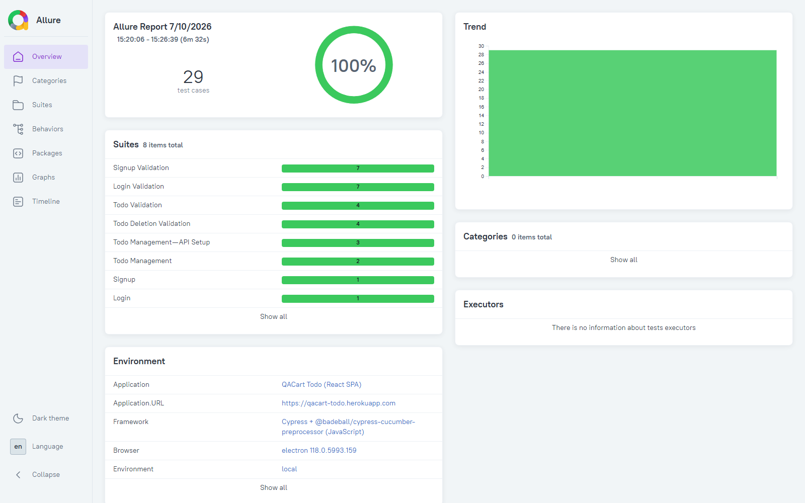

# ui_cypress_bdd

**Cypress 13.17 · @badeball/cypress-cucumber-preprocessor · JavaScript · Node.js**
Application sous test : [QACart Todo](https://qacart-todo.herokuapp.com) — 9 features · 29 scénarios · 100% pass rate
Agents IA : 10 agents JavaScript · 7 patterns LLM · 8 prompts versionnés

> Guide complet des agents → [agents.md](agents.md)
> Portage fidèle de [`ui_playwright_bdd`](../ui_playwright_bdd/) (même app, mêmes scénarios) vers Cypress — voir [Différences d'idiome](#différences-didiome-vs-playwright) pour les écarts techniques rencontrés.

---

## Stack technique

| Couche | Technologie | Version |
|---|---|---|
| Langage | JavaScript | — (pas de TypeScript) |
| Automation | Cypress | 13.17.0 |
| BDD | @badeball/cypress-cucumber-preprocessor | ^26 |
| Bundler | esbuild (@bahmutov/cypress-esbuild-preprocessor) | ^2.2 |
| Rapport | Allure (allure-cypress, officiel allure-js) | ^3.6 |
| Browser | Electron 118 (headless) / Chrome | — |
| Agents IA | Node.js + Groq LLM | ≥ 18 |

---

## Structure du projet

```
ui_cypress_bdd/
├── cypress/
│   ├── e2e/features/            → 9 features Gherkin (Id01–Id09) · 29 scénarios, identiques à ui_playwright_bdd
│   ├── step_definitions/        → 1 fichier .js par feature + CommonSteps.js + hooks.js (reset contexte Mocha)
│   └── support/
│       ├── e2e.js                → require('allure-cypress')
│       ├── pages/                → BasePage, SignupPage, LoginPage, TodoPage (cy.get/.should)
│       ├── api/QACartApiClient.js → cy.request() — POST register/login (API Setup pattern)
│       ├── testData.js            → randomUser()
│       └── reporting/allureKpi.js → categories.json + environment.properties + historique Trend
├── scripts/
│   └── agents/                  → 10 agents IA JavaScript
│       ├── llm.js                Client LLM (Groq/Ollama) + 7 patterns
│       ├── jira-fetcher.js       Client Jira REST v3
│       └── shared/               tracer · circuit-breaker · memory-store · prompt-store
├── prompts/                      → 8 templates LLM versionnés (semver)
├── docs/                         → screenshots, dashboards générés
├── allure-history/               → historique Trend persistant (survit aux runs)
├── logs/ · memory/                → traces JSONL, circuit breaker, mémoire épisodique
├── cypress.config.js             → preprocesseur cucumber + esbuild + allure-cypress + retries natifs
├── agents.md                     → Architecture complète des agents
└── .env.example
```

---

## Prérequis

- Node.js ≥ 18
- Allure CLI (`npm install -g allure-commandline` ou via Scoop/Homebrew)
- Clé API Groq (pour les agents IA) — ou Ollama en local

---

## Installation

```bash
npm install

cp .env.example .env
# Remplir GROQ_API_KEY dans .env
```

---

## Exécution des tests

```bash
# Suite complète
npx cypress run --spec "cypress/e2e/features/**/*.feature"

# Par tag
npx cypress run --spec "cypress/e2e/features/**/*.feature" --env tags=@smoke
npx cypress run --spec "cypress/e2e/features/**/*.feature" --env tags=@critical
npx cypress run --spec "cypress/e2e/features/**/*.feature" --env tags=@negative
npx cypress run --spec "cypress/e2e/features/**/*.feature" --env tags=@api-setup

# Par feature
npx cypress run --spec "cypress/e2e/features/Id09_ApiSetupTest.feature"

# Mode interactif (debug, navigateur visible)
npx cypress open
```

> **Windows / Git Bash** : si `Cypress.exe` refuse de démarrer avec `bad option: --smoke-test`, vérifier que la variable d'environnement `ELECTRON_RUN_AS_NODE` n'est pas positionnée (`unset ELECTRON_RUN_AS_NODE`) — elle force tout binaire Electron à démarrer comme process Node nu.

---

## Rapport Allure

```bash
npm run allure:generate    # allure-report/
npm run allure:open        # ouvre dans le navigateur
npm run allure:report      # generate + open
```



Le rapport ci-dessus est celui du dernier run réel exécuté localement : **29 test cases, 100% pass**, Trend sur plusieurs runs, KPIs (Environment) et Categories générés automatiquement.

---

## Features & Scénarios

| Feature | Tags | Scénarios |
|---|---|---|
| Id01 — Signup | `@ui @signup @Id01 @smoke @regression @critical` | 1 |
| Id01 — Signup Negative | `@ui @signup @Id01 @negative @regression` | 7 |
| Id02 — Login | `@ui @login @Id02 @smoke @regression @critical` | 1 |
| Id05 — Login Negative | `@ui @login @Id05 @negative @regression` | 7 |
| Id03 — Todo Management | `@ui @todo @Id03 @smoke @regression` | 1 |
| Id03 — Todo Validation | `@ui @todo @Id03 @negative @regression` | 4 |
| Id04 — Todo Deletion | `@ui @todo @Id04 @regression` | 1 |
| Id04 — Todo Deletion Validation | `@ui @todo @Id04 @negative @regression` | 4 |
| **Id09 — API Setup** ✨ | `@ui @api-setup @regression` (+ `@smoke @critical` / `@negative` par scénario) | 3 |

**Total : 29 scénarios · 0 échec · 100% pass rate** (run réel local, 2 exécutions consécutives)

### Répartition par tag (mesurée sur les .feature réelles)

| Tag | Scénarios | Périmètre |
|---|---|---|
| `@regression` | 29 | Toutes les features |
| `@negative` | 23 | Cas d'erreur et validations |
| `@smoke` | 5 | Signup, Login, Todo, API Setup (2 scénarios) |
| `@critical` | 4 | Signup + Login + API Setup (2 scénarios) |
| `@api-setup` | 3 | Pattern Senior — préconditions via REST API |

**Page Objects :** `BasePage` · `SignupPage` · `LoginPage` · `TodoPage`

---

## Différences d'idiome vs Playwright

Cypress n'a pas d'API async (`await page.locator()...`) — les step definitions et Page Objects utilisent le style Cypress natif (`cy.get().should()`, retry intégré). Écarts rencontrés et corrigés pendant le portage :

| Sujet | Playwright | Cypress |
|---|---|---|
| État partagé entre steps | `World` custom (classe, browser lifecycle) | Contexte Mocha `this` — pas de classe, Cypress gère son propre navigateur |
| Précondition API | `request.newContext()` (isolé du navigateur) | `cy.request()` — **partage le cookie jar du navigateur** ⚠️ |
| Champ vide | `.fill('')` accepté | `cy.type('')` **lève une erreur** — `.clear()` seul suffit |
| Assertion "absent" | `.filter({hasText}).toHaveCount(0)` | `cy.get(sel).contains(txt)` échoue si `get()` ne trouve déjà rien → utiliser `cy.contains(sel, txt)` |
| Retry / screenshots | Flag `--retry`, code manuel de capture | Natifs (`retries`, `screenshotOnRunFailure` dans `cypress.config.js`) |
| Reporting Allure | `allure-cucumberjs` (runner cucumber-js autonome) | `allure-cypress` (officiel allure-js, cible le runner Cypress) |

**Piège le plus coûteux** : `cy.request()` utilisé pour créer un utilisateur via API (`POST /api/v1/users/register`) partage le cookie jar avec le navigateur. Si l'app pose un cookie de session à l'inscription, visiter ensuite `/login` redirige automatiquement vers `/todo` (déjà authentifié) — l'écran de login n'apparaît jamais, le test échoue avec *"element `[data-testid=email]` never found"*. Corrigé par `cy.clearCookies()` / `cy.clearLocalStorage()` juste après chaque précondition API, avant d'interagir avec le formulaire de login.

---

## Quality Gate

| Métrique | Seuil | Résultat |
|---|---|---|
| Pass Rate | ≥ 90% | ✅ 100% |
| Fail Rate | ≤ 5% | ✅ 0% |
| Confiance LLM | ≥ 0.70 | — |

---

## 10 agents IA

| Agent | Rôle | Commandes clés |
|---|---|---|
| `pipeline-agent.js` | Orchestrateur maître | `full` `quick` `report` `status` |
| `runner-agent.js` | Exécution `cypress run` + détection flaky | `run` `smoke` `critical` `flaky` `regression` `baseline` |
| `codegen-agent.js` | Génération feature/steps/pages JS par LLM | `spec` `steps` `pages` `gherkin` `preview` |
| `bug-agent.js` | Boucle agentique : analyse + réparation | `analyze` `repair` `report` |
| `quality-agent.js` | Triage + RCA + vérification adversariale | `triage` `rca` `verify` `full` |
| `advisor-agent.js` | Vote GO/NO-GO (self-consistency) + prédiction | `advise` `predict` `gate` `history` `memory` `report` |
| `reporting-agent.js` | KPI + dashboard + notifications + sync Jira | `kpi` `dashboard` `notify` `sync` `summary` `history` |
| `planning-agent.js` | Couverture des features + stories/sprints Jira | `stories` `sprint` `coverage` |
| `ci-agent.js` | Git + GitHub Actions + changelog | `ci run/watch/list` `pr create/list/merge` `release create/list` `git commit/push/status` |
| `observability-agent.js` | Traces + coûts LLM + circuit breaker + prompts | `metrics` `anomalies` `cost` `cb status/reset/cache` `prompts list/history/rollback` |

### Démarrage rapide agents

```bash
# Statut général
node scripts/agents/pipeline-agent.js status

# Pipeline rapide (run + triage + dashboard + gate)
node scripts/agents/pipeline-agent.js quick

# Pipeline complet
node scripts/agents/pipeline-agent.js full

# Triage automatique des échecs
node scripts/agents/bug-agent.js analyze

# Vote release GO/NO-GO
node scripts/agents/advisor-agent.js advise

# Couverture des features
node scripts/agents/planning-agent.js coverage analyze
```

---

## 7 patterns LLM

| Pattern | Usage |
|---|---|
| `chat` | Réponse directe (notification, commit message) |
| `chatStream` | Streaming (affichage temps réel) |
| `chatCot` | Chain-of-Thought (RCA, analyse de bug) |
| `chatStructured` | JSON typé avec retry (triage, prédiction) |
| `chatConfident` | Score de confiance — déclenche l'adversarial si < seuil |
| `chatAdversarial` | Critique croisée en 3 phases (vérification cohérence) |
| `chatSelfConsistent` | Vote majoritaire sur N appels (décision release) |

---

## 8 prompts versionnés

| Template | Agent | Pattern |
|---|---|---|
| `triage_classify.json` | quality-agent | chat_confident |
| `rca_analyze.json` | quality-agent | chat_cot |
| `repair_patch.json` | bug-agent | tool use (boucle agentique) |
| `tc_generate_ui.json` | codegen-agent | chat |
| `release_vote.json` | advisor-agent | chat_self_consistent |
| `predict_gate.json` | advisor-agent | chat_structured |
| `flaky_analyze.json` | runner-agent | chat |
| `qa_notify.json` | reporting-agent | chat |

```bash
node scripts/agents/observability-agent.js prompts list
node scripts/agents/observability-agent.js prompts history rca_analyze
node scripts/agents/observability-agent.js prompts rollback triage_classify
```

---

## Variables d'environnement

```env
BASE_URL=https://qacart-todo.herokuapp.com

# LLM (obligatoire — l'un ou l'autre)
GROQ_API_KEY=gsk_...
GROQ_MODEL=llama-3.3-70b-versatile
OLLAMA_HOST=http://localhost:11434
OLLAMA_MODEL=qwen2.5-coder:7b

# Jira (optionnel — planning/codegen/ci agents)
JIRA_BASE_URL=https://your-site.atlassian.net
JIRA_EMAIL=user@example.com
JIRA_TOKEN=...
JIRA_PROJECT=SCRUM

# Notifications (optionnel)
SLACK_WEBHOOK_URL=https://hooks.slack.com/...
TEAMS_WEBHOOK_URL=https://outlook.office.com/...
```

> `.env` ne doit **jamais** être commité.

---

## API Setup Pattern (Senior)

> Les préconditions de test ne passent **jamais** par l'UI signup.

```javascript
// Id09_ApiSetupTest.js
Given('I have a user created via API', function () {
  const user = randomUser();
  const api = new QACartApiClient();

  api.register(user).then((token) => {
    ctx.user = user;
    ctx.apiToken = token;
    // cy.request() partage le cookie jar : on nettoie pour retomber sur le vrai formulaire de login
    cy.clearCookies();
    cy.clearLocalStorage();
  });
});
```

| | Sans API Setup | Avec API Setup |
|---|---|---|
| Création user | UI Signup (lent, fragile) | `POST /api/v1/users/register` (~300ms) |
| Dépendance | Tests Login dépendent de Signup | Isolation totale |
| Si Signup cassé | Login + Todo échouent | Login + Todo passent quand même |

`QACartApiClient` utilise `cy.request()` (intégré à Cypress) — **zéro dépendance ajoutée**.

---

## Retry — Tests flaky

Mécanisme natif Cypress (pas de code custom) :

```js
// cypress.config.js
retries: { runMode: 2, openMode: 0 }
```

Chaque scénario échoué en mode `cypress run` est relancé jusqu'à 2 fois. Screenshot et vidéo automatiques à chaque tentative échouée (`screenshotOnRunFailure: true`, `video: true`).

---

## Allure — KPI auto-générés

```
cypress.config.js — setupNodeEvents
  ├── before:run  → categories.json + restauration allure-history/ (Trend)
  └── after:run   → environment.properties (KPIs calculés depuis les résultats du run)

cypress/support/reporting/allureKpi.js
  ├── writeCategoriesJson()        Infrastructure / App Assertion / Framework Errors
  ├── writeEnvironmentProperties() Pass/Fail Rate, Quality Gate, Browser, Duration
  ├── persistHistory()             allure-report/history/ → allure-history/ (persistant)
  └── restoreHistory()             allure-history/ → allure-results/history/ (avant generate)
```

`allure-history/` est **hors de `allure-results/`** et `allure-report/` (tous deux régénérés à chaque run) — c'est ce qui permet au Trend de survivre entre les exécutions.

---

## CI/CD — GitHub Actions

Le workflow `.github/workflows/ci-cypress.yml` se déclenche sur :
- Push sur `main` (path : `ui_cypress_bdd/**`)
- Pull Request vers `main`
- Dispatch manuel
- Planification hebdomadaire (dimanche 09h00 UTC)

**Étapes :**
1. Checkout + Node.js 20
2. `npm ci`
3. `cypress-io/github-action` — Chrome headless sur `cypress/e2e/features/**/*.feature`
4. Génération + upload du rapport Allure
5. Upload vidéos/screenshots en cas d'échec
6. Job Summary avec pass rate calculé

---

*Framework QA développé avec Cypress, cypress-cucumber-preprocessor, Groq AI et le même écosystème d'agents que `ui_playwright_bdd`.*
