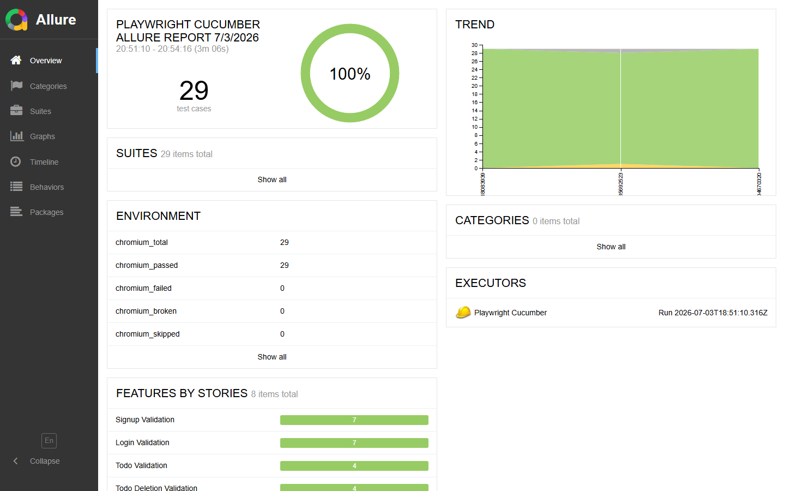

# QA Platform — Playwright BDD + AI Agents


> **Playwright + CucumberJS + Groq AI** — Un framework de test qui se pilote, s'analyse et se documente lui-même.

---

## Vue d'ensemble

```
Spec métier  →  User Stories  →  Feature files  →  Tests  →  Rapport  →  Tickets Jira
     ↑                                                  ↓
     └────────────── 11 agents IA pilotent tout ────────┘
```

Un seul fichier markdown suffit pour générer des scénarios Gherkin, les implémenter, les exécuter, analyser les échecs, créer les tickets Jira et produire un rapport. **Sans intervention manuelle.**

## Rapport Allure



---

## Les 11 agents IA

### Cœur du système

| Agent | Commande | Ce qu'il fait |
|-------|----------|---------------|
| `llm.js` | *(module partagé)* | Détecte automatiquement **Groq** (cloud gratuit) ou **Ollama** (local). Tous les agents passent par lui. |
| `jira-fetcher.js` | *(module partagé)* | Client Jira REST réutilisable — stories, epics, tickets, commentaires. |

### Pipeline QA

| Agent | Commande | Ce qu'il fait |
|-------|----------|---------------|
| `spec-agent.js` | `npm run agent:spec` | Lit un fichier de spec, extrait les user stories via LLM, génère les `.feature` + `.ts` et crée un **Epic Jira** avec toutes les stories liées. |
| `generate-agent.js` | `npm run agent:generate` | Analyse les features existantes, détecte les lacunes de couverture et génère automatiquement les nouveaux scénarios manquants. |
| `execute-agent.js` | `npm run agent:execute` | Orchestre l'exécution des tests. Si des échecs → lance le bug-analyzer → re-run automatique après correction. |
| `bug-analyzer.js` | `npm run agent:bug` | Lit les résultats Allure, identifie les causes racines via tool use, applique des correctifs de code directement dans les fichiers `.ts`. |
| `qa-agent.js` | `npm run agent:qa` | Analyse en streaming la qualité globale de la suite de tests, enrichit la base de connaissances RAG. |
| `report-agent.js` | `npm run agent:report` | Génère un rapport professionnel depuis les résultats Allure + l'analyse de bugs. |

### Intégration Jira

| Agent | Commande | Ce qu'il fait |
|-------|----------|---------------|
| `jira-agent.js` | `npm run agent:jira` | Récupère les stories Jira, les mappe aux `.feature` existants via LLM, génère la matrice de traçabilité. |
| `jira-ticket-agent.js` | `npm run agent:ticket` | Lit les échecs Allure, génère des tickets **Bug Jira structurés** via LLM, évite les doublons automatiquement. |

### Browser Automation

| Agent | Commande | Ce qu'il fait |
|-------|----------|---------------|
| `mcp-agent.js` | `npm run agent:mcp` | Connecte un LLM à un navigateur Chromium réel via **Playwright MCP** (23 outils browser). Exploration intelligente de l'application. |

---

## Pipeline complet en une commande

```bash
npm run agent:pipeline
```

```
[spec-agent]       Spec → User Stories → Features + Jira Epic
      ↓
[generate-agent]   Détecte les scénarios manquants
      ↓
[execute-agent]    Lance les tests
      ↓  (si échecs)
[bug-analyzer]     Analyse + correction automatique du code
      ↓
[execute-agent]    Re-run après correction
      ↓
[report-agent]     Rapport Allure professionnel
      ↓
[jira-ticket-agent] Tickets Bug créés dans Jira
```

---

## Stack technique

```
Tests          Playwright + CucumberJS BDD (TypeScript)
LLM            Groq Cloud (llama-3.3-70b-versatile) — gratuit 14 400 req/jour
               Ollama (local, fallback) — 100% privé
Reporting      Allure Reports avec historique
Gestion projet Jira Cloud REST API v3
Browser AI     @playwright/mcp — 23 outils browser natifs
```

---

## Démarrage rapide

### 1. Prérequis

```bash
node >= 18
npm install
npx playwright install chromium
```

### 2. Configuration

```bash
cp .env.example .env
# Renseigne les variables dans .env :
#   GROQ_API_KEY     → clé gratuite sur console.groq.com
#   JIRA_BASE_URL    → https://ton-site.atlassian.net
#   JIRA_EMAIL       → ton email Atlassian
#   JIRA_TOKEN       → token sur id.atlassian.com/manage-profile/security/api-tokens
#   JIRA_PROJECT     → clé du projet (ex: SCRUM)
```

### 3. Lancer les tests

```bash
npm test                          # tous les tests
npm run test:allure               # tests + rapport Allure
npm run agent:execute             # pipeline IA complet
```

### 4. Créer des tests depuis une spec

```bash
# 1. Dépose ta spec dans specs/ma-feature.md
# 2. Lance l'agent
npm run agent:spec -- --file=specs/ma-feature.md
# → Feature files générés + Stories Jira créées automatiquement
```

---

## Structure du projet

```
ui_playwright_bdd/
├── scripts/agents/          # 11 agents IA
│   ├── llm.js               # Helper LLM partagé (Groq/Ollama)
│   ├── jira-fetcher.js      # Client Jira partagé
│   ├── spec-agent.js        # Spec → User Stories → Features
│   ├── generate-agent.js    # Génération de scénarios manquants
│   ├── execute-agent.js     # Orchestration d'exécution
│   ├── bug-analyzer.js      # Analyse + correction de bugs
│   ├── qa-agent.js          # Analyse qualité
│   ├── report-agent.js      # Génération de rapports
│   ├── jira-agent.js        # Traçabilité Jira ↔ Features
│   ├── jira-ticket-agent.js # Création automatique de tickets
│   └── mcp-agent.js         # Browser automation via MCP
├── src/
│   ├── features/            # Scénarios Gherkin (Id01–Id08)
│   ├── steps/               # Step definitions TypeScript
│   ├── pages/               # Page Object Model
│   ├── hooks/               # Before/After hooks Allure
│   └── support/             # Fixtures et données de test
├── specs/                   # Fichiers de spécification métier
├── RAG/                     # Base de connaissances QA
├── docs/                    # Rapports générés (traçabilité, bugs, specs)
└── .env.example             # Template de configuration
```

---

## Commandes agents

```bash
npm run agent:spec            # Spec → User Stories + Jira Epic
npm run agent:spec:dry        # Simulation sans créer de fichiers
npm run agent:generate        # Génère les scénarios manquants
npm run agent:execute         # Exécute les tests avec pipeline IA
npm run agent:bug             # Analyse et corrige les échecs
npm run agent:qa              # Analyse qualité de la suite
npm run agent:report          # Rapport de test professionnel
npm run agent:jira            # Matrice traçabilité Jira ↔ Features
npm run agent:ticket          # Crée les tickets Bug dans Jira
npm run agent:ticket:dry      # Simulation tickets (sans créer)
npm run agent:mcp             # Exploration browser via IA
npm run agent:pipeline        # Pipeline complet de bout en bout
```

---

## Pourquoi ce framework

| Problème classique | Ce framework |
|--------------------|--------------|
| Écrire les tests manuellement | `agent:spec` génère features + steps depuis une spec |
| Déboguer les échecs à la main | `agent:bug` lit les logs et patche le code |
| Créer les tickets à la main | `agent:ticket` les crée automatiquement depuis Allure |
| Traçabilité stories / tests perdue | `agent:jira` la maintient à jour en continu |
| Rapport d'exécution basique | `agent:report` produit un document professionnel |

---

*Framework développé avec Playwright, CucumberJS, Groq AI et Playwright MCP.*
