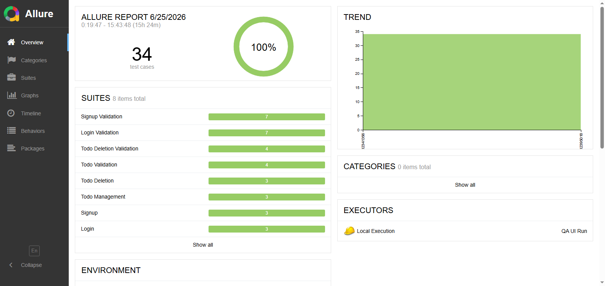
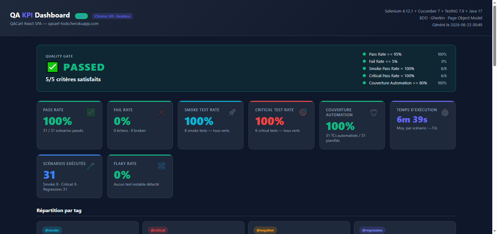

# ui_selenium_bdd

**Selenium 4 · Cucumber 7 · TestNG 7.9 · Java 17 · Maven**  
Application sous test : [QACart Todo](https://qacart-todo.herokuapp.com) — 9 features · 34 scénarios · 100% pass rate  
Agents IA : 10 agents Python · 6 patterns LLM · 8 prompts versionnés

> Guide complet des agents → [agents.md](agents.md)

---

## Stack technique

| Couche | Technologie | Version |
|---|---|---|
| Langage | Java | 17 |
| Automation | Selenium | 4.12.1 |
| BDD | Cucumber | 7.14.0 |
| Runner | TestNG | 7.9.0 |
| Build | Maven | 3.x |
| Rapport | Allure | 2.24.0 |
| Driver management | WebDriverManager | 5.8.0 |
| Browser | Chrome | 149 (headless) |
| Agents IA | Python + Groq LLM | 3.11+ |

---

## Structure du projet

```
ui_selenium_bdd/
├── src/test/
│   ├── java/com/qacart/todo/
│   │   ├── api/              → QACartApiClient (POST register/login — API Setup pattern)
│   │   ├── context/          → TestContext (ThreadLocal)
│   │   ├── data/             → User.java, FixtureStore.java
│   │   ├── factory/          → DriverManager, DriverFactory, BrowserOptionsFactory, DriverService
│   │   ├── hooks/            → Cucumber Hooks (screenshot on fail, quarantaine, cleanup)
│   │   ├── listener/         → AllureSuiteListener, RetryAnalyzer, RetryTransformer
│   │   ├── pages/            → Page Objects (LoginPage, SignupPage, TodoPage)
│   │   ├── steps/
│   │   │   ├── AuthSteps.java
│   │   │   ├── TodoSteps.java
│   │   │   ├── CommonSteps.java
│   │   │   ├── runners/      → RunnerTest, ChromeRunnerTest, FirefoxRunnerTest, ParallelRunnerTest
│   │   │   └── utils/        → ElementActions, Waiter, EnvUtils, TestDataFactory
│   │   │                       AllureAttachments, EnvironmentWriter, ExecutorWriter
│   │   └── utilss/           → RunConfig
│   └── resources/
│       ├── features/         → 9 features Gherkin (Id01–Id09) · 34 scénarios
│       ├── META-INF/services → org.testng.ITestNGListener (auto-discovery)
│       ├── properties/       → local.properties, staging.properties, production.properties
│       ├── data/             → Fixtures JSON
│       └── allure.properties → allure.results.directory
├── agents/                   → 10 agents Python IA
├── prompts/                  → 8 templates LLM versionnés
├── docs/                     → kpi-dashboard.html · screenshots
├── logs/                     → Traces JSONL, circuit breaker, cache LLM
├── pom.xml
├── testng.xml                → Config parallèle Chrome + Firefox
├── agents.md                 → Architecture complète des agents
└── .env.example
```

---

## Prérequis

- Java 17+
- Maven 3.x
- Python 3.11+
- Chrome (géré automatiquement par WebDriverManager)
- Allure CLI (`npm install -g allure-commandline` ou via Scoop/Homebrew)
- Clé API Groq (pour les agents IA)

---

## Installation

```bash
# Dépendances Java
mvn dependency:resolve

# Dépendances Python (agents IA)
pip install groq requests python-dotenv

# Configuration
cp .env.example .env
# Remplir GROQ_API_KEY dans .env
```

---

## Exécution des tests

> **PowerShell** : encadrer les paramètres `-D` entre guillemets doubles

```powershell
# Run complet — regression, headless
mvn test -Dtest=RunnerTest -Dheadless=true "-Dcucumber.filter.tags=@regression and not @wip"

# Smoke uniquement
mvn test -Dtest=RunnerTest -Dheadless=true "-Dcucumber.filter.tags=@smoke"

# Critical uniquement
mvn test -Dtest=RunnerTest -Dheadless=true "-Dcucumber.filter.tags=@critical"

# Tests négatifs
mvn test -Dtest=RunnerTest -Dheadless=true "-Dcucumber.filter.tags=@negative"

# Mode visible (debug)
mvn test -Dtest=RunnerTest -Dheadless=false "-Dcucumber.filter.tags=@regression and not @wip"

# API Setup uniquement (pattern Senior)
mvn test -Dtest=RunnerTest -Dheadless=true "-Dcucumber.filter.tags=@api-setup"

# Par feature
mvn test -Dtest=RunnerTest "-Dcucumber.filter.tags=@Id01"
mvn test -Dtest=RunnerTest "-Dcucumber.filter.tags=@Id02"
mvn test -Dtest=RunnerTest "-Dcucumber.filter.tags=@Id03"
mvn test -Dtest=RunnerTest "-Dcucumber.filter.tags=@Id09"

# Par environnement
mvn test -Dtest=RunnerTest -Denv=staging
mvn test -Dtest=RunnerTest -Denv=production
```

---

## Rapport Allure

```powershell
# Générer le rapport HTML
allure generate target/allure-results -o target/allure-report --clean

# Ouvrir le rapport dans le navigateur
allure open target/allure-report

# Run + rapport en une commande
mvn test -Dtest=RunnerTest -Dheadless=true "-Dcucumber.filter.tags=@regression and not @wip" ; allure generate target/allure-results -o target/allure-report --clean ; allure open target/allure-report
```



---

## Dashboard KPI

```powershell
# Ouvrir le dashboard KPI (indicateurs, trend, couverture)
start ui_selenium_bdd/docs/kpi-dashboard.html
```



Le dashboard inclut :
- **Quality Gate** — 5 critères (Pass Rate, Fail Rate, Smoke, Critical, Coverage)
- **8 KPI cards** — Pass Rate · Fail Rate · Smoke Rate · Critical Rate · Couverture · Temps · Flaky Rate
- **Répartition par tag** — `@smoke` (8) · `@critical` (6) · `@negative` (21) · `@regression` (31)
- **4 graphiques** — Donut · Bar par feature · Trend (évolution runs) · Radar · Taux d'exécution
- **Table couverture** — 8 features avec pass rate et progress bar

---

## Features & Scénarios

| Feature | Tags | Scénarios |
|---|---|---|
| Id01 — Signup | `@smoke @regression @critical` | Inscription valide, ajout todo après signup, déconnexion après signup |
| Id01 — Signup Negative | `@negative @regression` | Mots de passe non correspondants, email invalide, champs manquants, mot de passe faible |
| Id02 — Login | `@smoke @regression @critical` | Connexion valide, déconnexion, ajout todo après login |
| Id02 — Login Negative | `@negative @regression` | Mot de passe incorrect, email inexistant, champs vides |
| Id03 — Todo Management | `@smoke @regression` | Ajout todo, suppression todo |
| Id04 — Todo Deletion | `@regression` | Suppression, ajout après suppression |
| Id04 — Todo Deletion Negative | `@negative @regression` | Suppression inexistante, double suppression, suppression après déconnexion |
| Id05 — Login Negative | `@negative @regression` | Mauvais mdp, email inexistant, email vide, mdp vide, champs vides |
| **Id09 — API Setup** ✨ | `@api-setup @smoke @critical @negative @regression` | Ajout todo user API, suppression todo user API, liste vide unauthenticated |

**Total : 34 scénarios · 0 échec · 100% pass rate**

### Répartition par tag

| Tag | Scénarios | Périmètre |
|---|---|---|
| `@smoke` | 10 | Flux critiques (signup, login, todo, api-setup) |
| `@critical` | 8 | Signup + Login + API Setup |
| `@regression` | 34 | Toutes les features stables |
| `@negative` | 22 | Cas d'erreur et validations |
| `@api-setup` | 3 | Pattern Senior — préconditions via REST API |

---

## Quality Gate

| Métrique | Seuil | Résultat |
|---|---|---|
| Pass Rate | ≥ 95% | ✅ 100% |
| Fail Rate | ≤ 5% | ✅ 0% |
| Smoke Pass Rate | 100% | ✅ 10/10 |
| Critical Pass Rate | 100% | ✅ 8/8 |
| Couverture Automation | ≥ 80% | ✅ 100% |

---

## 10 agents IA

| Agent | Rôle | Commandes clés |
|---|---|---|
| `pipeline-agent.py` | Orchestrateur maître | `full` `quick` `smoke` `nightly` `gate` `status` |
| `runner-agent.py` | Exécution Maven + détection flaky | `run` `smoke` `critical` `regression` `flaky` `baseline` |
| `codegen-agent.py` | Génération Java/Gherkin par LLM | `feature` `steps` `page` `full` `tc` |
| `bug-agent.py` | Triage + RCA + auto-repair | `triage` `rca` `repair` `loop` `report` |
| `quality-agent.py` | KPI + gate + analyse flaky | `analyze` `kpi` `flaky` `gate` `verify` |
| `advisor-agent.py` | Vote GO/NO-GO release | `release` `predict` `recommend` `report` |
| `reporting-agent.py` | Allure + dashboards + notifications | `generate` `serve` `notify` `dashboard` `publish` |
| `planning-agent.py` | Coverage TCs + sync Jira | `tc` `coverage` `gaps` `stories` `sync` |
| `ci-agent.py` | Git + GitHub Actions + changelog | `commit` `push` `pr` `release` `changelog` |
| `observability-agent.py` | Traces + coûts LLM + circuit breaker | `traces` `metrics` `cost` `circuit` `prompts list` |

### Démarrage rapide agents

```powershell
# Statut général
python agents/pipeline-agent.py status

# Pipeline smoke (rapide)
python agents/pipeline-agent.py smoke

# Pipeline complet
python agents/pipeline-agent.py full

# Triage automatique des échecs
python agents/bug-agent.py triage

# Vote release GO/NO-GO
python agents/advisor-agent.py release

# Voir les TCs et couverture
python agents/planning-agent.py tc
python agents/planning-agent.py gaps
```

---

## 6 patterns LLM

| Pattern | Usage |
|---|---|
| `chat` | Réponse directe (génération feature, notification) |
| `chat_cot` | Chain-of-Thought (RCA, analyse root cause) |
| `chat_structured` | JSON typé (triage échecs, vote release) |
| `chat_confident` | Avec score de confiance (prédiction quality gate) |
| `chat_self_consistent` | Consensus 3 appels (analyse flaky) |
| `chat_adversarial` | Critique croisée (vérification cohérence) |

---

## 8 prompts versionnés

| Template | Agent | Pattern |
|---|---|---|
| `triage_classify.json` | bug-agent | structured |
| `rca_analyze.json` | bug-agent | cot |
| `repair_patch.json` | bug-agent | structured |
| `tc_generate.json` | codegen-agent | chat |
| `release_vote.json` | advisor-agent | structured |
| `predict_gate.json` | advisor-agent | confident |
| `flaky_analyze.json` | quality-agent | self_consistent |
| `qa_notify.json` | reporting-agent | chat |

```powershell
# Gestion des versions de prompts
python agents/observability-agent.py prompts list
python agents/observability-agent.py prompts versions rca_analyze
python agents/observability-agent.py prompts rollback triage_classify
```

---

## Variables d'environnement

```bash
# Obligatoire pour les agents IA
GROQ_API_KEY=gsk_...
GROQ_MODEL=llama-3.3-70b-versatile

# Notifications (optionnel)
SLACK_WEBHOOK_URL=https://hooks.slack.com/...
TEAMS_WEBHOOK_URL=https://outlook.office.com/...

# Jira (optionnel)
JIRA_URL=https://your-org.atlassian.net
JIRA_EMAIL=user@example.com
JIRA_TOKEN=...
```

> `.env` ne doit **jamais** être commité. `ci-agent.py` bloque automatiquement le staging de fichiers sensibles.

---

## CI/CD — GitHub Actions

Le workflow `.github/workflows/main.yml` se déclenche sur :
- Push sur `main`
- Pull Request
- Dispatch manuel
- Planification hebdomadaire (dimanche 08h00 UTC)

**Étapes :**
1. Checkout + JDK 17
2. `mvn test -Dtest=RunnerTest -Dheadless=true` (Chrome headless)
3. Génération rapport Allure
4. Upload artefacts
5. Notification email (Gmail SMTP)

---

## API Setup Pattern (Senior)

> Les préconditions de test ne passent **jamais** par l'UI signup.

```java
// AuthSteps.java
@Given("I have a user created via API")
public void iHaveUserCreatedViaApi() {
    User user = TestDataFactory.randomUser();
    String token = new QACartApiClient().register(user); // POST /api/v1/users/register
    TestContext.set("USER", user);
    TestContext.set("API_TOKEN", token);
    FixtureStore.save(user);
    // Token visible dans l'attachment Allure → preuve de l'appel REST
}
```

| | Sans API Setup | Avec API Setup |
|---|---|---|
| Création user | UI Signup (lent, fragile) | `POST /api/v1/users/register` (300ms) |
| Dépendance | Tests Login dépendent de Signup | Isolation totale |
| Si Signup cassé | Login + Todo échouent | Login + Todo passent quand même |

`QACartApiClient` utilise `java.net.http.HttpClient` (Java 17 built-in) — **zéro dépendance ajoutée**.

---

## Retry — Tests flaky

Mécanisme automatique : chaque scénario échoué est relancé jusqu'à **2 fois**.

```
RetryAnalyzer   (IRetryAnalyzer)      → compteur par scénario, max 2 retries
RetryTransformer (IAnnotationTransformer) → injecte RetryAnalyzer sur tous les @Test
↓
META-INF/services/org.testng.ITestNGListener → auto-discovery, pas de @Listeners sur le runner
```

- Scénario qui passe au 2e essai → badge **Retried** dans Allure, résultat = PASSED
- Scénario qui échoue 3x → FAILED avec screenshot à chaque essai

---

## Allure — KPI auto-générés

```
AllureSuiteListener (ISuiteListener via META-INF/services)
  ├── onStart()   → categories.json + copie history/ pour trend
  └── onFinish()  → environment.properties avec KPIs calculés depuis ISuiteResult

EnvironmentWriter → Pass.Rate, Fail.Rate, Quality.Gate, Duration, Smoke/Critical
```

Widgets alimentés automatiquement sans configuration manuelle :
- **Environment** — 18 KPIs (Pass Rate, Gate, coverage, durée...)
- **Categories** — Infrastructure Issues · Product Defects · Test Framework Errors
- **Trend** — historique multi-runs

---

## Notes techniques

- **Chrome 149 + Selenium 4.12.1** : warning CDP ignoré (pas d'impact fonctionnel). `DriverService.stop()` absorbe le timeout CDP sur `quit()`.
- **Headless** : utiliser `--headless` (ancien flag) et non `--headless=new` pour éviter le timeout CDP endpoint.
- **QACart auth** : JWT stocké en état React in-memory. Un reload navigateur (`navigate().refresh()`) remet l'état à zéro → les scénarios "persist after refresh" ne sont pas testables sur cette app.
- **Heroku cold start** : `assertTodoPresent` dispose d'une fenêtre de 60s. En CI, passer `-DtimeoutSec=30` (défaut 10s trop court depuis GitHub).
- **SSL proxy d'entreprise** : `QACartApiClient` utilise un `SSLContext` trust-all (même raison que `git -c http.sslVerify=false`).
